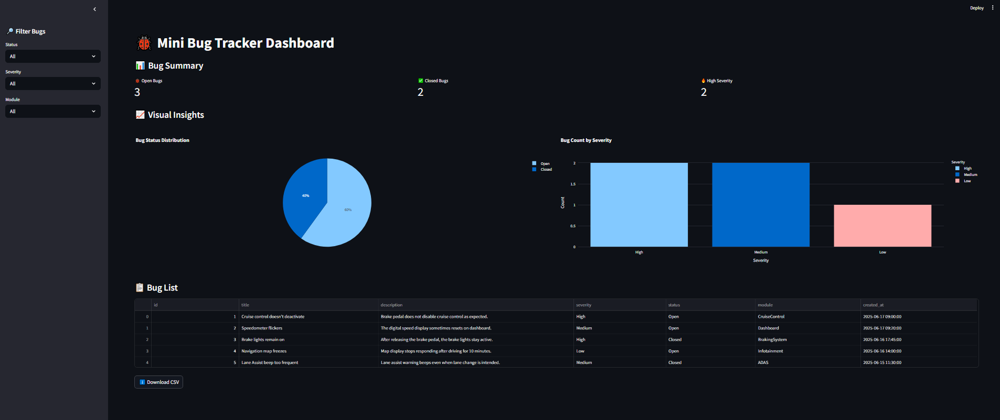

# 🐞 Bug Tracker Dashboard

A beginner-friendly bug tracking system built with **Python**, **SQLite**, **Streamlit**, and **Plotly**.  

This project simulates a simple issue management tool for tracking software bugs with real-time filtering, status monitoring, and visual insights.

---

## 🚀 Features

- Store bug reports with severity, status, and module info
- View and filter bugs in a clean dashboard
- Visualize data using pie and bar charts (Plotly)
- Export filtered bug reports as CSV
- Built with extensible and modular code structure

---

## 📊 Visualizations Included

- 🥧 **Pie Chart**: Open vs Closed bug distribution
- 📊 **Bar Chart**: Bug count by severity (Low, Medium, High)


## 📸 Dashboard User-Interface



---


## 📦 Tech Stack

- **Backend**: Python + SQLite
- **Frontend**: Streamlit
- **Visualization**: Plotly Express
- **Data Format**: JSON (for bulk insert)

---

## 📁 Folder Structure

```bash
mini_bug_tracker/
├── app.py # Streamlit dashboard app
├── create_db.py # Creates the SQLite database from schema
├── insert_data.py # Inserts sample bugs from JSON
├── sample_bugs.json # Example bug data
├── schema.sql # SQL table definition
├── bug_tracker.db # Auto-created SQLite DB file
└── README.md # Project documentation
```


---

## 🏁 How to Run

1. Install dependencies:

```bash
pip install streamlit plotly pandas
```

2. Create the database:


```bash
python create_db.py

```

3. Insert sample bugs:


```bash
python insert_data.py

```

4.Launch the dashboard:


```bash
streamlit run app.py 

```


## 🎯 Why This Project?

**This project was built to demonstrate:** 

- Practical Python and SQL skills

- Web dashboard development with Streamlit

- Real-time bug tracking and data filtering

- Visualization for DevOps and QA scenarios
